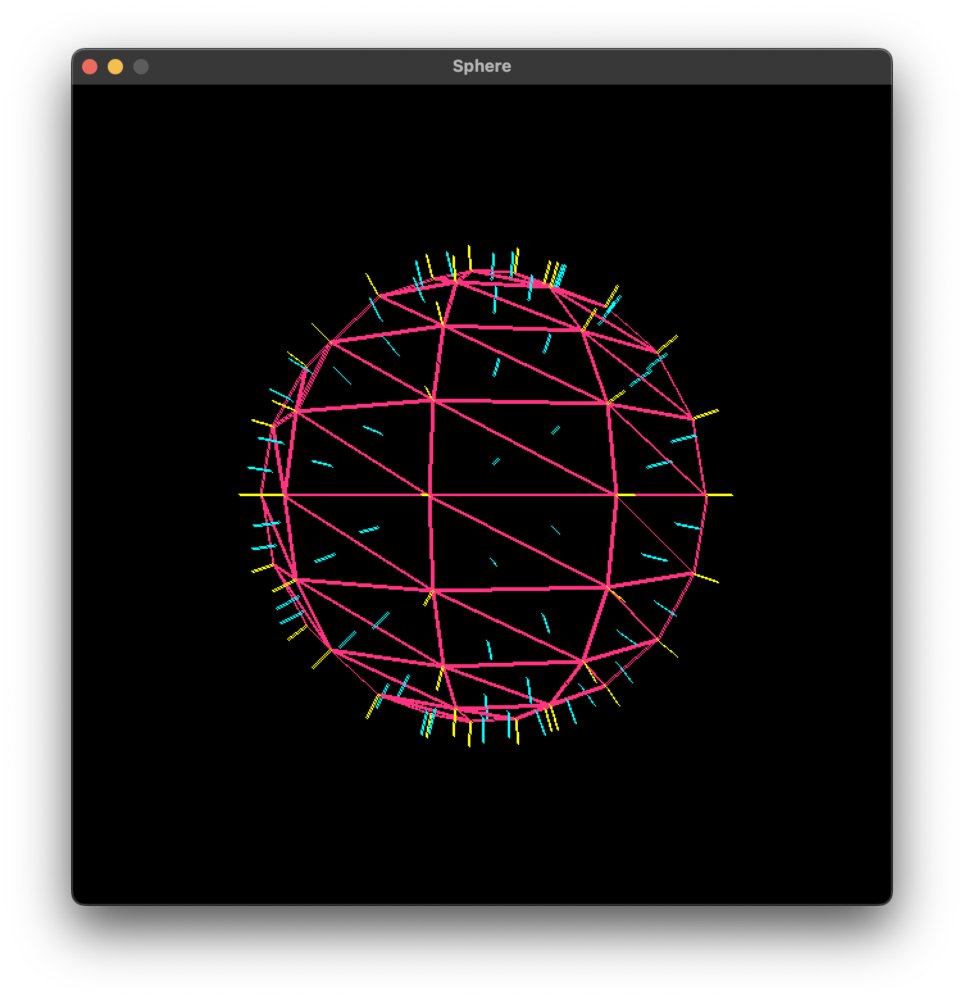

# CythGFX
A graphical example program that embeds the [Cyth](https://github.com/vldr/Cyth) programming language.



# Building

To build, you will need to have [CMake](https://cmake.org/) and gcc/clang/MSVC installed. 

### Linux

Run the following commands from the root directory (in a terminal):

```bash
mkdir build
cd build
cmake ..
make
```

### MacOS

Run the following commands from the root directory (in a terminal):

_Xcode project_:  
```
mkdir build
cd build
cmake -G Xcode ..
```

Then, in the `build` directory, open `cythgfx.xcodeproj` in Xcode.

_Makefile_:  
```bash
mkdir build
cd build
cmake ..
make
```

### Windows

Run the following commands from the root directory (in a terminal):

_Visual Studio 2022 project_:  
```
cmake.exe -S . -B build -G "Visual Studio 17 2022"
```

_Visual Studio 2026 project_:  
```
cmake.exe -S . -B build -G "Visual Studio 18 2026"
```

Then, in the `build` directory, open `cythgfx.sln` / `cythgfx.slnx` in Visual Studio.
